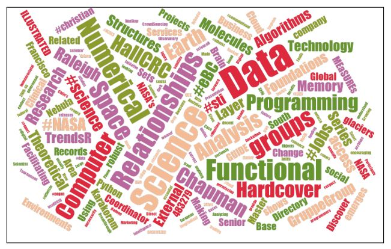
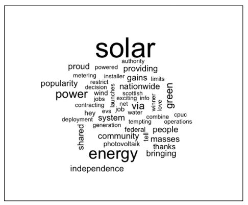

#第十三章 Word Perfect 文本挖掘
-----

        
在前面的章节中，我们掌握了一些测试和操作文本的最基本和最重要的函数。现在我们准备要做的是，分析出现在文本文中实实在在的文字。关于互联网的一些最基本的函数，像关键字搜索，通过分析“内容”，例如文体中的文字，来完成的。

本章开头的照片是所谓的“文字云”，它是通过测试在推特搜索中输入术语“数据科学”返回所有的文字生成的。（这个网页应用在[http://www.jasondavies.com](http://www.jasondavies.com "http://www.jasondavies.com")）。这些五颜六色的文字看起来挺有趣的，但是它们其实还隐含着一些有用的信息。图片上文字的几何排列一部分是随机的，一部分是为吸引眼球而精心设计的。文字的颜色也是。然而，字体的大小则是这个文字在这张众多文字组成的库中重要性的衡量。Corpus，拉丁语当中是“身体”的意思，它通常是文字分析者参考文本材料的文字，一般包含一个或多个文件。当我们考虑大量的文本数据，一组文档可以使任何东西：网页，你电脑上的文字处理文档，一组推文，或是政府报告。大多数情况下，文字分析者考虑文档集，每个文档集包含一些自然语言文本，这些自然语言文本就会被看做是一个语料库，如果他们打算集中分析所有的文档。

前面的“文字云”表明了“数据”和“科学”两个术语在推特的搜索结果当中显得非常重要，但搜索结果中还有其他无数的，看起来似乎不那么重要的，却也同样令人生趣的文字。我们看到“算法”，“分子”，“结构”，“调查”这些词，它们在数据科学的上下文中非常有用。我们还看到其他的术语，像“基督教徒”，“促进”和“协调员”这些看起来似乎和原搜索术语“数据科学”没有明显关联的词语。“文字云”这个小例子向我们展示了自然语言处理和搜索的相关领域的一项基本的挑战：确保文本分析产生的结果是和用户脑中的任务相关联的。

在本章我们将用到一些新的R包来扩展我们处理文本和从推特得到的数据中建立我们自己的文字云的能力。如果你还没有阅读上一章节“字符串原理”，那么你应该在继续本章前先去阅读的，因为我们在那里建立了一些技巧。

无论你阅读完上一章的那个地方，你需要取得并预处理一个推文的数据集，用一些你已经写好的代码，或者新的。在上一章的结尾，我们提供了一些TweetFrame()函数的样本代码，这个函数利用一个查找术语和一个最大的推文限制，然后返回一个按时间排序的包含推文的数据帧。虽然函数中注释很多，但真正的只有三行功能代码用到了twitteR包的功能，并且为我们从推特上得到了数据。下面的活动中，我们仍然利用上一章我们通过这一命令得到的数据帧进行工作：
<pre>
tweetDF <- TweetFrame("#solar",100)
</pre>
这就是数据帧，tweetDF,包含100条带"#solar"标签的推文，可推测出大多数关于太阳能和“绿色”相关的主题。在我们利用这两个新R包工作之前，我们可以通过丢弃大量对文字云没有任何意义的垃圾来改善显示质量。为了完成这个目的，我们调用了其他函数来去除多余的空格和所有的URL字符串，还去除了重复的推文标题，删除标签，消除了指向其他人的推文句柄。所有的这些变形，我们都采用了上一章中提到的字符串包中的字符串替换函数。举个例子，思考下下面这个口令，出现在CleanTweet()函数的倒数第二行：
<pre>
tweets <- str_replace_all(tweets, "@[a-z,A-Z]*","")  
</pre>
你应该觉得这行代码很容易理解，否则，你应该做多一点练习。左边很简单：我们用赋值箭头把右边表达式的结果赋给“tweets”这个数据对象。请注意，当这个语句在这章末尾处的函数中被执行时，“tweets”只是个临时数据对象变量，它在CleanTweets()中使用之后就会自动消失。

右边表达式用了stringr包中的str_replace_all()这个函数。我们使用"all"这个函数而不使用str_replace()，原因是我们希望每个推文可以进行多重匹配。str_replace_all()这个函数有3个参数。第一个是输入，它是一个字符串矢量(我们用"tweets"这个临时数据变量作为文本资源同时也作为它的目标输出)，第二个是要匹配的正则表达式，第三个是要替换匹配的字符串，其实是个空字符串，双引号中间什么也没有。本例中的正则表达式以“@”符号开头，后面跟着0个或多个小写或大写字母。最后的星号"*"就是代表0个或多个的意思。这个正则表达式会匹配推文中的任何相匹配的账户名字。

如果你看过一些推文，你会发现人们在发推文时经常相互@大家的推特账户名字，例如，@SolarFred时不时地就出现在推文文本当中。你可以自己做一些调查：用户名可以同时包含数字和字母吗？如果可以，你应该怎样修改上面的正则表达式，使它能够把0-9这些数字也成为用户名的一部分呢？另外，我们为什么要把用户名从推文内容中去除？如果我们没有去除它们，文字云会是个什么样子的呢？

无论你是键入本章末尾处的函数还是打算一条一条口令单独的输入，让我们获得一个在原数据帧之外的文本分离矢量开始吧：
<pre>
cleanText <- tweetDF$text  
head(cleanText, 10)
</pre>
做这个的唯一目的是简化展示的剩余部分。你可以很容易拷贝tweetDF$text数据到同一个数据帧的另一列，如果你想的话。我们把这个练习独立起来是因为我们不需要担心围绕数据帧的剩余部分的信息。上面的head()口令给你返回一个你开始工作的预览。现在让我们运行我们自定义的cleaning函数吧：
<pre>
cleanText <- CleanTweets(cleanText)
head(cleanText, 10)
</pre>
既然上面第一行我们用“cleanText”这个数据对象作为参数输入和目标输出。这是一个老式的计算机科学技巧，它是为了减少用到的临时变量的个数。这样，它恰恰会完成我们想要的，首先执行右边的表达式：把"cleanText"作为参数输入到CleanTweets()函数中运行，然后把返回的结果也赋给"cleanText"这个变量，覆盖了它原来的内容。请记住，我们允许对“cleanText”这个变量的内容做任何操作，因为它只是原数据的一个副本，而且我们的原数据是原封不动的（例如，tweetDF数据帧中的文本列）。

head()函数应该返回一个简短的被过滤了大量无关垃圾的推文列表。如果你跟着这些 步骤，“cleanText”就是一个为下面的工作做准备的字符串矢量(在这个例子中，刚好是100个字符串)。我们现在用"tm"包去处理我们的文本。本例中的"tm"是指“文本挖掘”，它是R提供的众多的文本分析包中比较受欢迎的一个包。另外，文本挖掘时是指从文本内容中解剖有用的可分析的信息的操作（corpora是corpus的复数）。虽然有些人认为文本挖掘和自然语言处理可以交替使用，但它们还是有些细微的差别需要我们考虑的。首先，文本挖掘的“挖掘”部分是指从大数据集中寻找意想不到的模式这种行为的领域，或者是某些人认为的从数据库中发现知识。相反地，自然语言处理更关注的是机器为什么能够通过编程来理解（或机器自己学习）或怎样识别人类语言，使其有意义。同样地，文本挖掘通常关注的是分析文本数据的统计学函数，使用像统计文本内容中文字频次的策略。在自然语言处理中，我们听到更多的是根据语言学，我们把文本按语法分成一个一个部分，例如名词和动词。在R中的“tm”包，我们可以十分肯定它是属于统计学的阵营，它主要是把文本内容分成一个文字序列，然后统计我们找到的不同的文字和序列。

首先，确定你安装了“tm”包并导入了R的副本和R-studio库内。你可以R-studio中的图形接口或者我们前一章写的EnsurePackage()函数。一旦tm包已经准备就绪，你就可以执行以下口令了：
<pre>
tweetCorpus <- Corpus(VectorSource(cleanText))   
tweetCorpus    
 A corpus with 100 text documents   
tweetCorpus <- tm_map(tweetCorpus, tolower)   
tweetCorpus <- tm_map(tweetCorpus, removePunctuation)   
tweetCorpus <- tm_map(tweetCorpus, removeWords, stopwords('english'))   
</pre>
在上一步中，我们用“tm”包将cleanText变量强制归入特定“Class”， 即语料库；并且将结果保存为一个新的数据对象”tweetCorpus“。这是我们第一次遇到一个”Class“。”Class“一词来源于计算机科学中的”面向对象编程“（OOP)。虽然R和面向对象编程语言（如Java）有很多不同，它仍然有很多基本功能来实现面向对象的编程。这里，我们介绍一些关于“Class”的基本知识。第一，“Class”只是一个关于数据结构的概念；第二，“Class”通过基本的数据形式来建立复杂的数据结构，例如数值型数据。例如，如果建立一个新的分类“Dashboard（数字仪表盘）”，我们可以引入“Miles Per Hour（小时里程数）“，”RPM“，以及“Fuel Level”来显示油位。由此，我们发现，R软件用户可以直接建立“类”。本例中，“tm”包的作者Ingo Feinerer，创建了一个新的门类，称之为语料库，成为了文本挖掘函数的核心数据结构（Feinerer，维也纳大学计算机科学教授，任职于数据库和人工智能研究组）。最后，本段讨论最重要的是，“类”不仅包含数据结构的概念，它还包含了函数的操作指南。换言之，“Class”是一个带有操作指引的数据对象，从简单操作，如添加、提取对象，到诸如画图之类的复杂操作过程。

在“tm”包的例子中，语料库定义了文本挖掘工作者所关心最基础的函数，一个包含了很多文件的语料集。我们一旦将文本储存到语料库中，“tm”包中自带的函数便可以使用了。上述中的最后三个命令展示了tm_map()函数的用法，该函数是tm包中非常有用的特性。在每一个用到tm_map()函数的例子中，我们将tweetCorpus作为自变量，另一个命令给语料数据变形。这里，我们进行了三次变换，首先将所有字母变成小写字母，然后去除标点符号，最后提取出所谓的“停用词”。

我们需要对停用词进行必要的解释。通过开发早期搜索引擎获得电子数据库的研究人员发现这样一个事实：一些停用词受到算法变化的影响。譬如“the”，“a”，“at”之类在文本中词频较高的词汇，对于文档的区分度就比较差了。而文档中词频较低的专有名词，动词，形容词对语料库中的文档区分度则比较高。因此，研究人员决定把常用且较短的词语除去。“停用词”一词可以追溯到上世纪六十年代，用来表示计算机操作系统由于数据处理任务毫无意义而终止。为了简化去除停用词的法则，tm包囊括了很多语言这类词的列表。在上页中的最后一个命令，我们去掉了所有常用的停用词。

这样，我们将语料处理成为了一个没有大写字母，标点符号，和停用词的词语集合。现在我们可以通过创建“文档矩阵” 这些语料进行一些统计分析了。下面tm包中的命令就新建了一个矩阵：

<pre>
tweetTDM <- TermDocumentMatrix(tweetCorpus)
</pre>

<pre>
## Error: 没有"TermDocumentMatrix"这个函数
</pre>

<pre>
tweetTDM
</pre>

<pre>
## Error: 找不到对象'tweetTDM'
</pre>

一个文档矩阵，有时也被称为文件-条目矩阵，具有矩形数据结构，以条目s为行，以文件s为列（在别的地方若需要反过来也可以）。条目可以是一个单个单词，比如“biology”，也可以是一个复合词汇，比如“data analysis”。通过统计学的方法来观察哪些词汇通常组成词组，然后判断词汇的形式（是否是一个词组），或者也可以通过词典的方式来解决这个问题。Tm包支持词典的方式，但是我们在这个例子中并没有使用。所以，如果一个条目，比如“data”在第一个文件中出现一次，在第二个文件中出现两次，在第三个文件中没有出现，那么条目数据的栏就会包含1，2，0。

统计量会告诉我们什么时候需要在命令行中输入tweetTDM显示结果。条目文件Matrix()函数从100个tweets中提取了375个条目s。结果矩阵有很多0；在矩阵中的37500个单元中，只有610个包括非0条目，剩下的36890个包含0。单元中有0表示特定的文件没有对应的特定条目。根据对输入tweets的最大单词长度，最大条目长度是21个词。最后，在尾行，以“Weighting”开头的表示这类数据存放在文档矩阵中。在这个案例中，我们使用了默认最简单的选项，只是以条目的形式简单地记录了次数的数量，它会出现在文集中的文件中。可以使用下面的检查函数查看文档矩阵：

<pre>
inspect(tweetTDM)
</pre>
<pre>
## Error: 没有"inspect"这个函数
</pre>

做好输出大量数据的准备。记住矩阵摘要中的条目“sparse”了吗？Sparse指大量包含0的单元——表明特点的条目并没有出现在给定的文件中。大多数的文档矩阵都是有许多0的。由于36890/37500 = 0.98，所以这个是98%稀疏的。大部分情况下，我们为了展示或者可视化的需求，需要精选或者填补文档矩阵。Tm工具包提供了多种方法来填补0条目，但是在这个例子中，我们将这个艰巨的任务交给词云工具包。

首先，我们需要安装并库化“wordcloud”工具包。正如其他工具包在R-Studio中使用工具包接口或者EnsurePackage()函数一样，这个我们在前面的章节已经介绍过。词云工具包是由自由统计学家Ian Fellows编写的，他还为R开发了“Deducer”用户接口。Deducer提供了图形接口，允许熟悉SPSS或SAS菜单系统的用户能够不必通过命令行来使用R。

加载词云工具包之后，我们需要做一些准备，使得数据就绪，提交给云生成函数。这个函数需要两个向量作为输入变量，第一个是条目的一列，第二个是条目出现的频率。条目列和频率必须以频率优先的方式排序。为了完成这个工作，我们需要将矩阵变成无格式数据矩阵，这样才能以频率排序。下面的第一个命令可以完成这个：

<pre>
tdMatrix <- as.matrix(tweetTDM)
</pre>
<pre>
## Error: 找不到对象'tweetTDM'
</pre>
<pre>
sortedMatrix <- sort(rowSums(tdMatrix), decreasing = TRUE)
</pre>

<pre>
## Error: 找不到对象'tdMatrix'
</pre>

<pre>
cloudFrame <- data.frame(word = names(sortedMatrix), freq = sortedMatrix)
</pre>

<pre>
## Error: 找不到对象'sortedMatrix'
</pre>

<pre>
wordcloud(cloudFrame$word, cloudFrame$freq)
</pre>

<pre>
## Error: 没有"wordcloud"这个函数
</pre>

在上面的第二行，我们完成的是：计算每一行的总数，给出了所有tweets/文件一个条目的总频率。我们还将结果以高频优先排序。结果是一个命令序列：每个条目有一个频率而且每个条目的名称是频率对应的名字。

第二行到最后一行程序，我们将从之前的命令从命名列中提取的名字绑定在一起，形成带频率的数据帧。这个数据帧，也就是“cloudFrame”，包括同名列中的确切信息。“序列化矩阵”，但是cloudFrame在不同数据栏中有多种名称。这样最后一个命令就简单了，就是调用wordcloud()函数。Wordcloud()函数有许多可选参数来丰富词云，例如调整它的形状，条目出现频率等。但是，这里为了使问题简单明了，我们全部用默认的参数。我们讨论了特定数据集在wordcloud()函数下的检索词表和频率表，得到下面的图片。

如果回顾我们从Twitter获取数据的过程，”solar（太阳）“是频率最高的词汇也就不难理解了（即使我们去掉了所有的标签）。词频第二高的是”energy（能量）“，随后，有很多相关的词语，比如”independence（自主的）“，”green（绿色的）“，”wind（风能）“，以及”metering（测量）“。

## 章节难点

基于以前我们建立的函数，建立一个可以查询词条的函数，来进行Twitter查询，清洗文本数据，简历文档矩阵，并且将词频输入wordcloud()函数中。这个主要是”turnkey“包可以实现的功能，即通过Twitter查询建立一个词云，正如本章最初提到的Jason Davies的观点一样。

### 本章资源

[http://cran.r-project.org/web/packages/wordcloud/wordcloud.pdf](http://cran.r-project.org/web/packages/wordcloud/wordcloud.pdf)

[http://www.dbai.tuwien.ac.at/staff/feinerer/](http://www.dbai.tuwien.ac.at/staff/feinerer/)

[http://en.wikipedia.org/wiki/Document-term_matrix](http://en.wikipedia.org/wiki/Document-term_matrix)

[http://en.wikipedia.org/wiki/Stop_words](http://en.wikipedia.org/wiki/Stop_words)

[http://en.wikipedia.org/wiki/Text_mining](http://en.wikipedia.org/wiki/Text_mining)

[http://stat.ethz.ch/R-manual/R-devel/library/base/html/colSums.html](http://stat.ethz.ch/R-manual/R-devel/library/base/html/colSums.html)

[http://www.jasondavies.com/wordcloud/](http://www.jasondavies.com/wordcloud/)

### 本章代码

<pre>
# CleanTweets() - Takes the junk out of a vector of tweet texts
CleanTweets <- function(tweets) {
    # Remove rudundant spaces
    tweets <- str_replace_all(tweets, " ", " ")
    # Get rid of URLs
    tweets <- str_replace_all(tweets, "http//t.co/[a-z,A-Z,0-9]{8}", "")
    # Take out retweet header, there is only one
    tweets <- str_replace(tweets, "RT @[a-z,A-Z]*: ", "")
    # Get rid of hashtags
    tweets <- str_replace_all(tweets, "#[a-z,A-Z]*", "")
    # Get rid of references to other screennames
    tweets <- str_replace_all(tweets, "@[a-z,A-Z]*", "")
    return(tweets)
}
</pre>

